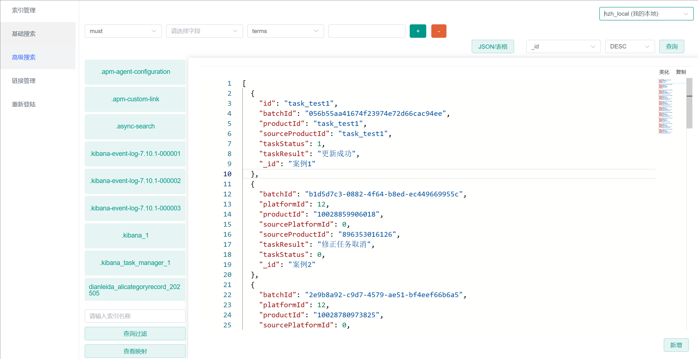
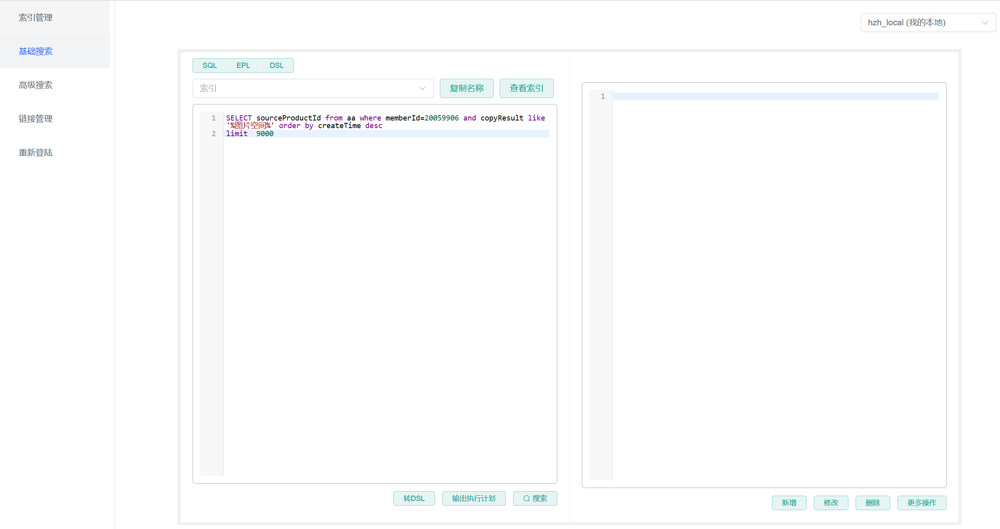

## 什么是 Es-Plus

Es-Plus 是Elasticsearch Api增强工具 - 只做增强不做改变，简化`CRUD`操作.

## 特点

- **无侵入**：Es-Plus 在 rest-high-level-client 的基础上进行扩展，只做增强不做改变.支持原生rest-high-level-client
- **融合mybatis-plus语法和ES-Rest-Api**: 适用于习惯mybatis-plus语法和会原生es语句操作的人群
- **优雅的聚合封装**：让es的聚合操作变得更简易
- **内置es所有分词器**：提供es所有的分词器和可配置定义filters
- **兼容es多版本**: 同时支持es6.7和es7.8双版本  支持最新版es 8.17
- **优雅的nested嵌套查询**: 使用lambda表达式封装实现更优雅的嵌套查询
- **静态链式es编程**: 支持使用静态类，无需指定对应实体类即可执行。可以简单快速对es的索引进行增删改查。
- **多数据源es**: 通用@EsIndex指定默认数据源
- **自定义es执行前后拦截器**: @EsInterceptors 具体用法见下面的例子
- **提供Es控制台页面**: 新功能-提供es多数据源增删改查的控制台 详见下方例子
## 引入
本次更新
- **多数据源es**: 通用@EsIndex指定默认数据源
- **自定义es执行前后拦截器**: @EsInterceptors 具体用法见下面的例子
优化了查询api的使用，更贴近es的查询语法

``` xml
      <dependency>
            <groupId>io.github.zhaohaoh</groupId>
            <artifactId>es-plus-spring-boot-starter</artifactId>
            <version>Latest Version</version>
        </dependency>
         <dependency>
            <groupId>io.github.zhaohaoh</groupId>
            <artifactId>es8-plus-spring-boot-starter</artifactId>
            <version>Latest Version</version>
        </dependency>
```
## 新-es控制台类似navicat es-head的es查询编辑工具。
### 下载es-plus-console的jar包 java -jar启动后 自动打开网站


## 简单两步! 快速开始!

###  第一步 application.peoperties配置

```properties
# es地址 多个逗号分隔   默认数据源 master
es-plus.address=xxx.xxx.xxx.xxx:9200
# 查询最大数量的限制
es-plus.global-config.search-size=5000
# 索引添加统一的环境后缀 测试环境
es-plus.global-config.global-suffix=_test
# 索引全局默认分词器    默认值ep_standard   可选 #ep_ik_max_word,ep_ik_smart,ep_simple,ep_keyword,ep_stop,ep_whitespace,ep_pattern,ep_language,ep_snowball
es-plus.global-config.default-analyzer=ep_ik_max_word
# 自定义全局refresh策略
es-plus.global-config.refresh-policy=wait_until
# 全局默认获取es的id的字段 默认id
es-plus.global-config.global-es-id=id
es-plus.username=
es-plus.password=

# es多版本  如果是8的话需要指定为8  否则会报错
es-plus.global-config.version=7


##es多数据源   local是数据源名称，可自定义

es-plus.client-properties.local.address=localhost:9100

```

### 第二步 添加 @EsIndexScan 注解

在 Spring Boot 启动类上添加 `@EsIndexScan` 注解：

```java
@SpringBootApplication
@EsIndexScan  // 必须添加：扫描并注册 ES 实体类索引
public class Application {
    public static void main(String[] args) {
        SpringApplication.run(Application.class, args);
    }
}
```

**作用**：
- 扫描带有 `@EsIndex` 注解的实体类
- 用于自动创建或更新索引字段

**注意**：
- 此注解仅用于索引管理（创建/更新）
- 不影响已有索引的查询操作

### 第三步 静态链式编程
```java
public class SamplesEsService extends EsServiceImpl<SamplesEsDTO> {
    // 无实体类使用指定index索引直接保存 查询同理
    public void update() {
        Map<String, Object> map = new HashMap<>();
        map.put("username", "fsdfsfds");
        map.put("id", "d73d1b4e46244b0db766987759d6e");
        Es.chainUpdate(Map.class).index("sys_user2ttt").save(map);
    }

    public void newSelect() {
        EsResponse<SamplesEsDTO> aaaaa = Es.chainLambdaQuery(SamplesEsDTO.class).term(SamplesEsDTO::getUsername, "hzh").list();
        System.out.println(aaaaa);
    }
}
```

## 💡 查询对比：es-plus vs 原生 ES

### es-plus 方式（10 行）
```java
EsResponse<User> response = userService.esChainQueryWrapper()
    .must()
    .term(User::getUsername, "admin")
    .ge(User::getAge, 18)
    .match(User::getText, "关键词")
    .sortByDesc(User::getCreateTime)
    .searchPage(1, 10);
List<User> list = response.getList();
```

### 原生 ES 方式（25 行）
```java
SearchSourceBuilder sourceBuilder = new SearchSourceBuilder();
BoolQueryBuilder boolQuery = QueryBuilders.boolQuery();
boolQuery.must(QueryBuilders.termQuery("username", "admin"));
boolQuery.must(QueryBuilders.rangeQuery("age").gte(18));
boolQuery.must(QueryBuilders.matchQuery("text", "关键词"));
sourceBuilder.query(boolQuery);
sourceBuilder.sort("createTime", SortOrder.DESC);
sourceBuilder.from(0);
sourceBuilder.size(10);

SearchRequest request = new SearchRequest("user");
request.source(sourceBuilder);
SearchResponse response = client.search(request, RequestOptions.DEFAULT);

List<User> list = new ArrayList<>();
for (SearchHit hit : response.getHits().getHits()) {
    list.add(JSON.parseObject(hit.getSourceAsString(), User.class));
}
```

**💡 代码量减少 60%，链式调用更简洁直观**

---

## 💡 聚合对比：es-plus vs 原生 ES

### es-plus 方式（10 行）
```java
EsResponse<User> response = userService.esChainQueryWrapper()
    .esLambdaAggWrapper()
    .terms(User::getUsername, e -> e.size(100))
        .subAgg(t -> t.sum(User::getId))
        .subAgg(t -> t.avg(User::getAge))
    .search();

Map<String, EsAggResult<User>> result = response.getEsAggsResponse()
    .getEsAggResult().getMultiBucketNestedMap("username_terms");
```

### 原生 ES 方式（26 行）
```java
SearchSourceBuilder sourceBuilder = new SearchSourceBuilder();
TermsAggregationBuilder termsAgg = AggregationBuilders
    .terms("username_terms").field("username").size(100);
termsAgg.subAggregation(AggregationBuilders.sum("id_sum").field("id"));
termsAgg.subAggregation(AggregationBuilders.avg("age_avg").field("age"));
sourceBuilder.aggregation(termsAgg);

SearchRequest request = new SearchRequest("user");
request.source(sourceBuilder);
SearchResponse response = client.search(request, RequestOptions.DEFAULT);

Terms usernameTerms = response.getAggregations().get("username_terms");
Map<String, Object> result = new HashMap<>();
for (Terms.Bucket bucket : usernameTerms.getBuckets()) {
    Sum sumAgg = bucket.getAggregations().get("id_sum");
    Avg avgAgg = bucket.getAggregations().get("age_avg");
    // 手动组装...
}
```

**💡 代码量减少 62%，自动封装结果无需手动解析**

---

## ORM映射方式

### 实体类定义
```java
@Data
@EsIndex(index = "sys_user")
public class SysUser {
    @EsId
    private Long id;
    @EsField(type = EsFieldType.KEYWORD)
    private String username;
    private String nickName;
    private Integer lockState;
    @EsField(type = EsFieldType.NESTED)
    private SysRole sysRole;
}
```

### 常规查询
```java
@Service
public class SysUserEsService extends EsServiceImpl<SysUser>{
    
    
    public void search() {
        // 声明语句嵌套关系是must
        EsResponse<SysUser> esResponse = esChainQueryWrapper().must()
                .terms(SysUser::getUsername, "admin", "hzh", "shi")
                // 多个must嵌套
                .must(a ->
                        // 声明内部语句关系的should
                        a.should()
                                .term(SysUser::getRealName, "dasdsad")
                                .term(SysUser::getPhone, "1386859111"))
                // 查询
                .list();
        List<SysUser> list = esResponse.getList();
    }

    public void agg() {
        // 声明语句嵌套关系是must
        EsChainQueryWrapper<SysUser> esChainQueryWrapper = esChainQueryWrapper().must()
                .terms(SysUser::getUsername, "admin", "hzh", "shi")
                // 多个must嵌套
                .must(a ->
                        // 声明内部语句关系的should
                        a.should()
                                .term(SysUser::getRealName, "dasdsad")
                                .term(SysUser::getPhone, "1386859111"));

        esChainQueryWrapper.esLambdaAggWrapper()
                // terms聚合并且指定数量10000
                .terms(SysUser::getUsername, a -> a.size(10000))
                // 在terms聚合的基础上统计lock数量
                .subAggregation(t -> t.count(SysUser::getLockSate));
        EsResponse<SysUser> esResponse = esChainQueryWrapper
                // 查询
                .list();
        List<SysUser> list = esResponse.getList();

        EsAggregationsResponse<SysUser> esAggregationsReponse = esResponse.getEsAggregationsReponse();
        
        // 以下方法选一种
        Terms terms = esAggregationsReponse.getTerms(SysUser::getUsername);
        Map<String, Long> termsAsMap = esAggregationsReponse.getTermsAsMap(SysUser::getUsername);
    }
    // 嵌套对象查询（二级嵌套）
    public void nested() {
        // Lambda 写法（推荐）
        EsResponse<SamplesEsDTO> esResponse = esChainQueryWrapper().must()
                .nestedQuery(SamplesEsDTO::getSamplesNesteds, SamplesNestedDTO.class, (esQueryWrap) -> {
                    esQueryWrap.mustNot()
                        .term(SamplesNestedDTO::getState, false)
                        .term(SamplesNestedDTO::getId, 2L);
                })
                .list();
        List<SamplesEsDTO> list = esResponse.getList();
    }
}


## Es版本
遇到版本冲突使用6.7.0和7.8.0

## 作者
 微信:huangzhaohao1995

# 版权 | License

[Apache License 2.0](https://www.apache.org/licenses/LICENSE-2.0)

