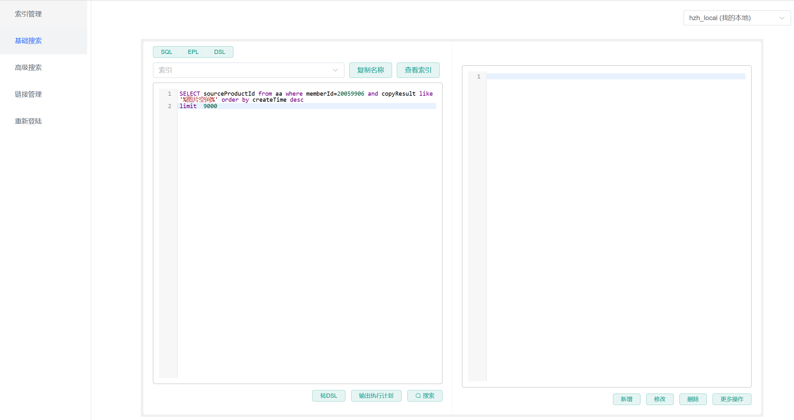

# Es-Plus 使用案例文档

## 1. 项目简介

Es-Plus 是一个强大的 Elasticsearch API 增强工具，旨在简化 Elasticsearch 的 CRUD 操作。

### 核心特性

- **无侵入**：在 rest-high-level-client 基础上扩展，只做增强不做改变
- **融合 MyBatis-Plus 语法**：适用于熟悉 MyBatis-Plus 的开发者
- **优雅的聚合封装**：让 ES 聚合操作更加简单
- **Lambda 表达式支持**：类型安全的查询构建
- **静态链式编程**：无需依赖注入，直接使用静态类操作
- **自动 Reindex**：索引结构变更时自动迁移数据
- **多版本支持**：兼容 ES 6.7、7.8、8.17
- **Nested 嵌套查询**：优雅的多级嵌套对象查询
- **多数据源**：支持多个 ES 集群连接
- **拦截器支持**：自定义 ES 执行前后的拦截逻辑

## 新-es控制台类似navicat es-head的es查询编辑工具

下载 es-plus-console 的 jar 包，使用 `java -jar` 启动后会自动打开网站：




---

## 快速开始提醒

⚠️ **重要**：使用 es-plus 前，请确保：

1. **添加依赖**：在 `pom.xml` 中添加 es-plus 依赖
2. **配置连接**：在 `application.properties` 中配置 ES 连接信息
3. **添加扫描注解**：在启动类上添加 `@EsIndexScan` 注解（**必须**）
4. **定义实体类**：使用 `@EsIndex` 注解标注实体类

缺少第3步会导致索引无法正确注册，这是最常见的配置错误！

---

## 2. 环境配置

### 2.1 Maven 依赖

```xml
<dependency>
    <groupId>io.github.zhaohaoh</groupId>
    <artifactId>es-plus-spring-boot-starter</artifactId>
    <version>Latest Version</version>
</dependency>
```

### 2.2 配置文件 (application.properties)

```properties
# ES 地址（多个逗号分隔）- 默认数据源 master
es-plus.address=localhost:9200

# ES 认证信息
es-plus.username=
es-plus.password=

# ES 版本配置（7 或 8）
es-plus.global-config.version=7

# 是否开启自动 reindex（默认 false，生产环境慎用）
es-plus.global-config.index-auto-move=false

# 是否异步 reindex
es-plus.global-config.reindex-async=false

# 查询最大数量限制
es-plus.global-config.search-size=5000

# 索引统一环境后缀
es-plus.global-config.global-suffix=_test

# 全局默认分词器
# 可选：ep_ik_max_word, ep_ik_smart, ep_simple, ep_keyword, ep_stop, ep_whitespace, ep_pattern
es-plus.global-config.default-analyzer=ep_ik_max_word

# 自定义全局 refresh 策略
es-plus.global-config.refresh-policy=wait_until

# 全局默认 ES ID 字段
es-plus.global-config.global-es-id=id

# 多数据源配置（local 是数据源名称，可自定义）
es-plus.client-properties.local.address=localhost:9100
es-plus.client-properties.local.username=
es-plus.client-properties.local.password=
```

### 2.3 启动类配置（重要）

**重要**：使用 es-plus 时，必须在 Spring Boot 启动类上添加 `@EsIndexScan` 注解，否则实体类无法正确注册索引。

```java
package com.es.plus.samples;

import com.es.plus.annotation.EsIndexScan;
import org.springframework.boot.SpringApplication;
import org.springframework.boot.autoconfigure.SpringBootApplication;

/**
 * 启动类配置
 * @EsIndexScan 注解用于扫描并注册 ES 实体类索引
 */
@SpringBootApplication
@EsIndexScan  // 必须添加此注解，用于扫描实体类并自动创建索引
public class SamplesApplication {
    public static void main(String[] args) {
        SpringApplication.run(SamplesApplication.class, args);
    }
}
```

**注解说明**：

- `@EsIndexScan`：扫描带有 `@EsIndex` 注解的实体类
- **作用**：自动注册索引映射，用于自动创建或更新索引字段
- **位置**：必须添加在 Spring Boot 启动类上
- **重要**：此注解只用于索引管理（创建/更新），不会影响已有索引的查询操作

**可选配置**：

```java
// 指定扫描包路径（可选，默认扫描启动类所在包及子包）
@EsIndexScan(basePackages = {"com.es.plus.samples.dto", "com.other.package"})
```

**常见错误**：

1. **忘记添加 `@EsIndexScan`**：
   - 现象：需要自动创建索引时无法创建
   - 解决：在启动类添加 `@EsIndexScan` 注解

2. **扫描路径不正确**：
   - 现象：部分实体类索引未被扫描到
   - 解决：检查扫描包路径是否包含所有实体类

3. **实体类缺少 `@EsIndex` 注解**：
   - 现象：扫描时跳过该实体类
   - 解决：确保实体类添加了 `@EsIndex` 注解

**注意**：如果索引已经存在，即使不添加 `@EsIndexScan` 注解，查询功能也能正常使用。此注解主要用于索引的自动创建和字段更新。

---

## 3. 实体类定义

### 3.1 基础实体类示例

```java
package com.es.plus.samples.dto;

import com.es.plus.annotation.EsField;
import com.es.plus.annotation.EsId;
import com.es.plus.annotation.EsIndex;
import com.es.plus.annotation.Score;
import com.es.plus.constant.EsFieldType;
import lombok.Data;

import java.util.Date;
import java.util.List;

/**
 * 快速测试实体类
 * 演示常见字段类型的映射
 */
@Data
@EsIndex(index = "fast_test", alias = "fast_test_alias", tryReindex = true)
public class FastTestDTO {

    // ES 文档 ID
    @EsId
    private Long id;

    // KEYWORD 类型：精确匹配、聚合、排序
    @EsField(type = EsFieldType.KEYWORD, ignoreAbove = 512)
    private String username;

    // TEXT 类型：全文检索
    @EsField(type = EsFieldType.TEXT)
    private String text;

    // LONG 类型：数值类型
    @EsField(type = EsFieldType.LONG)
    private Long age;

    // KEYWORD 数组
    @EsField(type = EsFieldType.KEYWORD)
    private List<String> testList;

    // DATE 类型：日期类型（支持多种格式）
    @EsField(
        type = EsFieldType.DATE,
        esFormat = "yyyy-MM-dd HH:mm:ss||strict_date_optional_time||epoch_millis",
        dateFormat = "yyyy-MM-dd HH:mm:ss",
        timeZone = "+0"
    )
    private Date createTime;

    // 自定义字段名
    @EsField(type = EsFieldType.TEXT, name = "username_test")
    private String usernameTest;

    // 评分字段
    @Score
    private Float score;
}
```

### 3.2 嵌套对象实体类

```java
package com.es.plus.samples.dto;

import com.es.plus.annotation.EsField;
import com.es.plus.annotation.EsId;
import com.es.plus.annotation.EsIndex;
import com.es.plus.constant.Analyzer;
import com.es.plus.constant.EsFieldType;
import lombok.Data;

import java.util.Date;
import java.util.List;

/**
 * 包含嵌套对象的实体类
 */
@Data
@EsIndex(index = "sys_user2ttt", alias = "sys_user2ttt_alias", tryReindex = true)
public class SamplesEsDTO {

    @EsId
    private Long id;

    @EsField(type = EsFieldType.KEYWORD, normalizer = Analyzer.EP_NORMALIZER)
    private String username;

    // copyTo：将字段值复制到另一个字段
    @EsField(copyTo = "keyword")
    private String email;

    @EsField(copyTo = "keyword")
    private String phone;

    @EsField(type = EsFieldType.KEYWORD)
    private String keyword;

    @EsField(copyTo = "keyword")
    private String nickName;

    // store：是否单独存储字段值
    @EsField(store = true)
    private int sex;

    private Boolean lockState;

    @EsField(
        type = EsFieldType.DATE,
        esFormat = "yyyy-MM-dd'T'HH:mm:ss'Z' || yyyy-MM-dd HH:mm:ss || yyyy-MM-dd || yyyy-MM-dd'T'HH:mm:ss.SSS'Z'"
    )
    private Date date;

    // NESTED 类型：嵌套对象数组
    @EsField(type = EsFieldType.NESTED)
    private List<SamplesNestedDTO> samplesNesteds;

    @EsField(type = EsFieldType.NESTED)
    private List<SamplesNestedDTO> samplesNestedObjects;
}
```

### 3.3 嵌套子对象

```java
package com.es.plus.samples.dto;

import com.es.plus.annotation.EsField;
import com.es.plus.constant.EsFieldType;
import lombok.Data;

import java.util.List;

/**
 * 二级嵌套对象
 */
@Data
public class SamplesNestedDTO {

    private Long id;

    @EsField(type = EsFieldType.KEYWORD)
    private String username;

    @EsField(type = EsFieldType.KEYWORD)
    private String email;

    private Boolean state;

    // 三级嵌套
    @EsField(type = EsFieldType.NESTED)
    private List<SamplesNestedInnerDTO> samplesNestedInner;
}
```

---

## 4. 服务类定义

### 4.1 继承 EsServiceImpl

```java
package com.es.plus.samples.service;

import com.es.plus.core.service.EsServiceImpl;
import com.es.plus.samples.dto.FastTestDTO;
import org.springframework.stereotype.Service;

@Service
public class FastTestService extends EsServiceImpl<FastTestDTO> {
    // 继承后自动拥有 CRUD 方法
}
```

---

## 5. 普通查询案例

### 5.1 es-plus vs 原生 ES 查询对比

es-plus 提供了简洁的链式查询方式。下面通过对比展示 es-plus 和原生 ES 的差异。

**核心优势**：
- ✅ Lambda 表达式，类型安全
- ✅ 链式调用，简洁直观
- ✅ 自动封装结果，无需手动解析

#### 案例1：es-plus 查询方式

```java
/**
 * es-plus 查询方式（完整示例）
 *
 * 查询代码：10 行
 *
 * 对比原生 ES：
 * - 原生 ES：25 行
 *
 * 代码量减少：60%
 */
@Test
public void esPlusQuery() {
    // ========== 查询（10 行）==========
    EsResponse<FastTestDTO> response = fastTestService.esChainQueryWrapper()
        .must()
        .term(FastTestDTO::getUsername, "酷酷的")
        .ge(FastTestDTO::getAge, 18)
        .match(FastTestDTO::getText, "苹果")
        .sortByDesc(FastTestDTO::getCreateTime)
        .includes(FastTestDTO::getId, FastTestDTO::getUsername, FastTestDTO::getAge)
        .searchPage(1, 10);

    List<FastTestDTO> list = response.getList();
    System.out.println("查询结果：" + list.size() + " 条");
}
```

#### 案例2：原生 ES 查询方式

```java
/**
 * 原生 ES 查询方式（完整示例）
 *
 * 查询代码：25 行
 *
 * 对比 es-plus：
 * - es-plus：10 行
 *
 * 代码量减少：60%
 */
@Test
public void nativeEsQuery() {
    // ========== 查询（25 行）==========
    SearchSourceBuilder sourceBuilder = new SearchSourceBuilder();

    BoolQueryBuilder boolQuery = QueryBuilders.boolQuery();
    boolQuery.must(QueryBuilders.termQuery("username", "酷酷的"));
    boolQuery.must(QueryBuilders.rangeQuery("age").gte(18));
    boolQuery.must(QueryBuilders.matchQuery("text", "苹果"));

    sourceBuilder.query(boolQuery);
    sourceBuilder.sort("createTime", SortOrder.DESC);
    sourceBuilder.fetchSource(
        new String[]{"id", "username", "age"},
        null
    );
    sourceBuilder.from(0);
    sourceBuilder.size(10);

    SearchRequest searchRequest = new SearchRequest("fast_test");
    searchRequest.source(sourceBuilder);

    SearchResponse searchResponse = restHighLevelClient.search(
        searchRequest,
        RequestOptions.DEFAULT
    );

    SearchHits hits = searchResponse.getHits();
    List<FastTestDTO> list = new ArrayList<>();
    for (SearchHit hit : hits.getHits()) {
        FastTestDTO dto = JSON.parseObject(hit.getSourceAsString(), FastTestDTO.class);
        list.add(dto);
    }

    System.out.println("查询结果：" + list.size() + " 条");
}
```

---

### 5.2 Term/Terms 精确查询

**适用场景**：精确匹配 KEYWORD 类型字段

```java
/**
 * Term/Terms 查询：精确匹配
 * 适用于 KEYWORD 类型字段
 */
@Test
public void termQuery() {
    // Term 查询：单值精确匹配
    EsResponse<FastTestDTO> response1 = fastTestService.esChainQueryWrapper()
        .term(FastTestDTO::getUsername, "酷酷的")
        .search();

    System.out.println("Term 查询结果：" + response1.getList());

    // Terms 查询：多值匹配（类似 SQL IN）
    EsResponse<FastTestDTO> response2 = fastTestService.esChainQueryWrapper()
        .terms(FastTestDTO::getUsername, "酷酷的", "小明", "小红")
        .search();

    System.out.println("Terms 查询结果：" + response2.getList().size() + " 条");
}
```

### 5.3 常用查询类型（Match/Range/Fuzzy/Wildcard）

展示常用的几种查询类型及其适用场景。

```java
/**
 * 常用查询类型综合示例
 */
@Test
public void commonQueryTypes() {
    // 1. Match 查询：全文检索（会分词）
    // 适用于 TEXT 类型字段
    EsResponse<FastTestDTO> response1 = fastTestService.esChainQueryWrapper()
        .match(FastTestDTO::getText, "苹果")
        .search();
    System.out.println("Match 全文检索结果：" + response1.getList().size() + " 条");

    // 2. MultiMatch 查询：在多个字段中搜索
    // 只要有一个字段匹配即可
    EsResponse<FastTestDTO> response2 = fastTestService.esChainQueryWrapper()
        .multiMatch("苹果", FastTestDTO::getText, FastTestDTO::getUsername)
        .search();
    System.out.println("MultiMatch 多字段匹配结果：" + response2.getList().size() + " 条");

    // 3. Match Phrase 查询：短语匹配
    // 最能代替 wildcard 的查询方式，推荐使用
    // 词语必须按顺序出现
    EsResponse<FastTestDTO> response3 = fastTestService.esChainQueryWrapper()
        .matchPhrase(FastTestDTO::getText, "第二篇文章")
        .search();
    System.out.println("Match Phrase 短语匹配结果：" + response3.getList().size() + " 条");

    // 4. Range 查询：范围查询
    // 适用于数值和日期类型
    EsResponse<FastTestDTO> response4 = fastTestService.esChainQueryWrapper()
        .ge(FastTestDTO::getAge, 18)  // 大于等于 18
        .le(FastTestDTO::getAge, 60)  // 小于等于 60
        .search();
    System.out.println("Range 范围查询（年龄 18-60）：" + response4.getList().size() + " 条");

    // 5. Fuzzy 查询：模糊查询（容错查询）
    // 允许一定程度的拼写错误
    // EpFuzziness.ONE：允许1个字符的差异
    // EpFuzziness.TWO：允许2个字符的差异
    EsResponse<FastTestDTO> response5 = fastTestService.esChainQueryWrapper()
        .fuzzy(FastTestDTO::getUsername, "苦苦的", EpFuzziness.ONE)
        .search();
    System.out.println("Fuzzy 模糊查询结果（可以查到'酷酷的'）：" + response5.getList().size() + " 条");

    // 6. Wildcard 查询：通配符查询
    // * 表示任意字符，? 表示单个字符
    // 注意：性能较差，建议使用 matchPhrase 代替
    EsResponse<FastTestDTO> response6 = fastTestService.esChainQueryWrapper()
        .wildcard(FastTestDTO::getText, "*苹果*")
        .search();
    System.out.println("Wildcard 通配符查询结果：" + response6.getList().size() + " 条");
    // 警告：通配符查询在长字符串上性能很差，80 字符可能需要 400 毫秒以上
}
```

### 5.4 条件查询（动态查询）

**适用场景**：根据条件动态添加查询条件，常用于多条件搜索

```java
/**
 * 条件查询：根据参数是否为空动态添加查询条件
 * 第一个参数为 boolean 类型，true 时才添加该条件
 *
 * 包含：基础条件判断 + 嵌套 should 条件
 */
@Test
public void conditionalQuery() {
    // 模拟前端传来的搜索参数（可能为空）
    String keyword = "苹果";
    String username = "";     // 空字符串，不添加该条件
    Integer minAge = 18;
    Integer maxAge = null;    // null，不添加该条件
    String titleKeyword = "手机";
    String descKeyword = null;  // 不搜索描述
    List<String> tags = Arrays.asList("电子产品", "数码");

    EsResponse<ProductDTO> response = Es.chainLambdaQuery(ProductDTO.class)
        .must()
        // 关键词不为空时，才进行全文检索
        .match(keyword != null && !keyword.isEmpty(), ProductDTO::getText, keyword)
        // 用户名不为空时，才进行精确匹配
        .term(username != null && !username.isEmpty(), ProductDTO::getUsername, username)
        // 最小年龄不为 null 时，才添加范围条件
        .ge(minAge != null, ProductDTO::getAge, minAge)
        .le(maxAge != null, ProductDTO::getAge, maxAge)
        // 嵌套 should：标题或描述包含关键词
        .must(wrapper -> {
            var shouldWrapper = wrapper.should();
            // 标题关键词不为空时才搜索标题
            shouldWrapper.match(titleKeyword != null && !titleKeyword.isEmpty(),
                ProductDTO::getTitle, titleKeyword);
            // 描述关键词不为空时才搜索描述
            shouldWrapper.match(descKeyword != null && !descKeyword.isEmpty(),
                ProductDTO::getDescription, descKeyword);
        })
        // 标签列表不为空时才添加 terms 条件
        .terms(tags != null && !tags.isEmpty(), ProductDTO::getTags, tags.toArray())
        .search();

    System.out.println("条件查询结果：" + response.getList().size() + " 条");
}
```

**条件查询最佳实践**：

1. **字符串判断**：`str != null && !str.isEmpty()`
2. **对象判断**：`obj != null`
3. **集合判断**：`list != null && !list.isEmpty()`
4. **数值判断**：`num != null`（注意使用包装类型，如 Integer、Long）

### 5.5 布尔查询（Must/Should/MustNot/Filter）

展示四种布尔查询类型及其组合使用。

```java
/**
 * 布尔查询：Must/Should/MustNot/Filter 综合示例
 */
@Test
public void boolQuery() {
    // 1. Must 查询：所有条件必须满足（AND 逻辑）
    EsResponse<FastTestDTO> response1 = fastTestService.esChainQueryWrapper()
        .must()  // 声明使用 must 逻辑
        .match(FastTestDTO::getText, "苹果")
        .ge(FastTestDTO::getAge, 18)
        .term(FastTestDTO::getUsername, "酷酷的")
        .search();
    System.out.println("Must 查询（所有条件都满足）：" + response1.getList().size() + " 条");

    // 2. Should 查询：满足任一条件即可（OR 逻辑）
    EsResponse<FastTestDTO> response2 = fastTestService.esChainQueryWrapper()
        .should()  // 声明使用 should 逻辑
        .term(FastTestDTO::getUsername, "酷酷的")
        .term(FastTestDTO::getUsername, "小明")
        .term(FastTestDTO::getUsername, "小红")
        .search();
    System.out.println("Should 查询（满足任一条件）：" + response2.getList().size() + " 条");

    // 3. MustNot 查询：排除符合条件的文档（NOT 逻辑）
    EsResponse<FastTestDTO> response3 = fastTestService.esChainQueryWrapper()
        .mustNot()  // 排除条件
        .term(FastTestDTO::getUsername, "酷酷的")
        .search();
    System.out.println("MustNot 查询（排除username=酷酷的）：" + response3.getList().size() + " 条");

    // 4. Filter 查询：过滤条件（不计算评分，性能更好）
    // 适用于精确匹配、范围查询等不需要评分的场景
    EsResponse<FastTestDTO> response4 = fastTestService.esChainQueryWrapper()
        .filter()  // 声明使用 filter
        .term(FastTestDTO::getUsername, "酷酷的")
        .ge(FastTestDTO::getAge, 18)
        .search();
    System.out.println("Filter 查询（不计算评分）：" + response4.getList().size() + " 条");

    // 5. 组合布尔查询：must、should、mustNot、filter 组合使用
    // 注意：这些条件需要通过嵌套的方式组合，不能直接在同一级混用
    EsResponse<FastTestDTO> response5 = fastTestService.esChainQueryWrapper()
        // 必须满足：年龄 >= 18
        .must()
        .ge(FastTestDTO::getAge, 18)
        // 嵌套 filter 条件：创建时间在指定范围内（不计算评分）
        .must(wrapper ->
            wrapper.filter()
                .range(FastTestDTO::getCreateTime, "2023-01-01", "2024-12-31")
        )
        // 嵌套 mustNot 条件：排除黑名单用户
        .must(wrapper ->
            wrapper.mustNot()
                .term(FastTestDTO::getUsername, "黑名单用户")
        )
        // 嵌套 should 条件：text 包含"苹果"或"香蕉"
        .must(wrapper ->
            wrapper.should()
                .match(FastTestDTO::getText, "苹果")
                .match(FastTestDTO::getText, "香蕉")
        )
        .search();
    System.out.println("组合布尔查询结果：" + response5.getList().size() + " 条");
}
```

### 5.6 嵌套布尔查询

**重要提示**：`must()`、`should()`、`mustNot()`、`filter()` 不能在同一级直接混用，必须通过嵌套方式组合。

```java
/**
 * 嵌套布尔查询：实现 (A AND B) AND (C OR D)
 */
@Test
public void nestedBoolQuery() {
    EsResponse<SamplesEsDTO> response = samplesEsService.esChainQueryWrapper()
        .must()
        .terms(SamplesEsDTO::getUsername, "admin", "hzh", "shi")
        // 嵌套 should 条件：实现 OR 逻辑
        .must(a ->
            a.should()
                .term(SamplesEsDTO::getNickName, "张三")
                .term(SamplesEsDTO::getPhone, "13868591111")
        )
        .search();

    System.out.println("嵌套布尔查询结果：" + response.getList());
}
```

**嵌套规则**：
- 同一类型条件可以连续调用
- 不同类型必须通过 `.must(wrapper -> wrapper.should()...)` 嵌套

### 5.7 Nested 嵌套对象查询

**适用场景**：查询嵌套对象数组中的元素

```java
/**
 * Nested 查询：嵌套对象查询（用于 NESTED 类型字段）
 */
@Test
public void nestedQuery() {
    // 使用 Lambda 表达式（推荐，类型安全）
    EsResponse<SamplesEsDTO> response = samplesEsService.esChainQueryWrapper()
        .must()
        .nestedQuery(
            SamplesEsDTO::getSamplesNesteds,
            SamplesNestedDTO.class,
            esQueryWrap -> {
                esQueryWrap.mustNot()
                    .term(SamplesNestedDTO::getState, false)
                    .term(SamplesNestedDTO::getId, 2L);
            }
        )
        .search();

    System.out.println("嵌套查询结果：" + response.getList());
}
```

### 5.8 分页与大数据遍历

展示三种分页方式及其适用场景。

```java
/**
 * 分页与大数据遍历综合示例
 */
@Test
public void paginationQuery() {
    // 1. 普通分页：适用于小数据量、浅层分页
    int page = 1;  // 页码（从 1 开始）
    int size = 10; // 每页数量
    EsResponse<FastTestDTO> response1 = fastTestService.esChainQueryWrapper()
        .match(FastTestDTO::getText, "苹果")
        .searchPage(page, size);
    System.out.println("普通分页 - 第 " + page + " 页，共 " + response1.getTotal() + " 条");

    // 2. Scroll 滚动查询：适用于大数据量遍历
    // 比深度分页性能更好
    String scrollId = null;
    int scrollTimes = 3;  // 滚动次数
    int scrollSize = 100; // 每次获取数量
    for (int i = 0; i < scrollTimes; i++) {
        EsResponse<SamplesEsDTO> scrollResponse =
            samplesEsService.esChainQueryWrapper().must()
                .sortByAsc("id")
                .scroll(scrollSize, scrollId);
        scrollId = scrollResponse.getScrollId();
        System.out.println("Scroll 滚动 - 第 " + (i + 1) + " 次，获取 " + scrollResponse.getList().size() + " 条");
    }

    // 3. SearchAfter 深度分页：深度分页的高性能方案
    // 通过上一页的排序值获取下一页
    EsResponse<SamplesEsDTO> response2 = Es.chainLambdaQuery(SamplesEsDTO.class)
        .orderBy("ASC", SamplesEsDTO::getId)
        .searchAfter(null);
    System.out.println("SearchAfter - 第一页：" + response2.getList().size() + " 条");

    // 第二页（使用上一页的尾部排序值）
    Object[] tailSortValues = response2.getTailSortValues();
    EsResponse<SamplesEsDTO> response3 = Es.chainLambdaQuery(SamplesEsDTO.class)
        .orderBy("ASC", SamplesEsDTO::getId)
        .searchAfter(tailSortValues);
    System.out.println("SearchAfter - 第二页：" + response3.getList().size() + " 条");
}
```

### 5.9 其他常用操作

```java
/**
 * 其他常用操作综合示例
 */
@Test
public void otherOperations() {
    // 1. 排序查询
    EsResponse<FastTestDTO> response1 = fastTestService.esChainQueryWrapper()
        .sortByDesc(FastTestDTO::getCreateTime)
        .sortByAsc(FastTestDTO::getAge)
        .search();
    System.out.println("排序结果：" + response1.getList().size() + " 条");

    // 2. Count 统计数量（只统计，不返回文档）
    long count = Es.chainLambdaQuery(FastTestDTO.class)
        .term(FastTestDTO::getUsername, "酷酷的")
        .count();
    System.out.println("Count 统计：" + count + " 条");

    // 3. 指定返回字段（减少网络传输）
    EsResponse<FastTestDTO> response2 = fastTestService.esChainQueryWrapper()
        .includes(FastTestDTO::getId, FastTestDTO::getUsername, FastTestDTO::getAge)
        .search();
    System.out.println("指定字段：只返回 id、username、age");

    // 4. Profile 性能分析
    EsResponse<SamplesEsDTO> response3 = samplesEsService.esChainQueryWrapper()
        .must()
        .terms(SamplesEsDTO::getUsername, "admin", "hzh", "shi")
        .profile()  // 启用性能分析
        .search();
    System.out.println("Profile 分析完成");

    // 5. 静态链式查询（无需注入 Service）
    EsResponse<FastTestDTO> response4 = Es.chainLambdaQuery(FastTestDTO.class)
        .term(FastTestDTO::getUsername, "酷酷的")
        .search();
    System.out.println("静态查询结果：" + response4.getList().size() + " 条");
}
```

---

## 6. 聚合查询案例

#### 📊 代码量对比（同样的聚合需求）
#### 案例1：es-plus 聚合方式

```java
/**
 * es-plus 聚合方式（完整示例：配置 + 解析）
 * 包含：Terms、子聚合（Sum/Count/Avg）、Filter 聚合
 *
 * 配置代码：10 行（链式调用，简洁清晰）
 * 解析代码：10 行（自动封装，无需类型转换）
 * 总计：20 行
 *
 * 对比原生 ES：
 * - 原生 ES 配置：28 行
 * - 原生 ES 解析：42 行
 * - 原生 ES 总计：70 行
 *
 * 代码量减少：71%
 *
 * 💡 提示：对比下面的 nativeEsAggregationParsing() 方法
 */
@Test
public void comprehensiveAggregation() {
    // ========== 配置聚合（10 行）==========
    EsResponse<SamplesEsDTO> response = samplesEsService.esChainQueryWrapper().must()
        .ge(SamplesEsDTO::getId, 1)
        .esLambdaAggWrapper()
        .terms(SamplesEsDTO::getUsername, e -> e.size(100))
            .subAgg(t -> t.sum(SamplesEsDTO::getId))
            .subAgg(t -> t.count(SamplesEsDTO::getId))
            .subAgg(t -> t.avg(SamplesEsDTO::getAge))
        .filter("active_users", () -> {
            EsWrapper<SamplesEsDTO> filter = samplesEsService.esChainQueryWrapper();
            filter.term(SamplesEsDTO::getLockState, false);
            return filter;
        }, filterAgg -> filterAgg.terms(SamplesEsDTO::getSex))
        .search();

    // ========== 解析聚合结果（10 行）==========
    EsAggResult<SamplesEsDTO> result = response.getEsAggsResponse().getEsAggResult();

    Map<String, Long> usernameStats = response.getEsAggsResponse()
        .getTermsAsMap(SamplesEsDTO::getUsername);

    Map<String, EsAggResult<SamplesEsDTO>> usernameTerms = result
        .getMultiBucketNestedMap("username_terms");

    usernameTerms.forEach((username, bucketResult) -> {
        Double idSum = bucketResult.getSum("id_sum");
        Long idCount = bucketResult.getCount("id_count");
        Double ageAvg = bucketResult.getAvg("age_avg");
    });

    Map<String, Long> sexStats = result.getSingleBucketNested("active_users")
        .getMultiBucketMap("sex_terms");
}

/**
 * 原生 ES 聚合方式（完整示例：配置 + 解析）
 *
 * 配置代码：28 行（SearchSourceBuilder + AggregationBuilders）
 * 解析代码：42 行（手动遍历 + 类型转换）
 * 总计：70 行
 *
 * 对比 es-plus：
 * - es-plus 配置：10 行
 * - es-plus 解析：10 行
 * - es-plus 总计：20 行
 *
 * 代码量减少：71%
 */
@Test
public void nativeEsAggregationParsing() {
    // ========== 配置聚合（19 行）==========
    SearchSourceBuilder sourceBuilder = new SearchSourceBuilder();
    sourceBuilder.query(QueryBuilders.rangeQuery("id").gte(1));

    TermsAggregationBuilder termsAgg = AggregationBuilders
        .terms("username_terms")
        .field("username")
        .size(100);

    termsAgg.subAggregation(AggregationBuilders.sum("id_sum").field("id"));
    termsAgg.subAggregation(AggregationBuilders.count("id_count").field("id"));
    termsAgg.subAggregation(AggregationBuilders.avg("age_avg").field("age"));

    sourceBuilder.aggregation(termsAgg);

    FilterAggregationBuilder filterAgg = AggregationBuilders
        .filter("active_users", QueryBuilders.termQuery("lockState", false));

    filterAgg.subAggregation(
        AggregationBuilders.terms("sex_terms").field("sex")
    );

    sourceBuilder.aggregation(filterAgg);

    // ========== 解析聚合结果（26 行）==========
    Aggregations aggregations = response.getEsAggsResponse().getAggregations();

    Terms usernameTerms = aggregations.get("username_terms");
    Map<String, Long> nativeUsernameStats = new HashMap<>();
    for (Terms.Bucket bucket : usernameTerms.getBuckets()) {
        String username = bucket.getKeyAsString();
        long docCount = bucket.getDocCount();
        nativeUsernameStats.put(username, docCount);

        Aggregations subAggs = bucket.getAggregations();

        Sum sumAgg = subAggs.get("id_sum");
        double idSum = sumAgg.getValue();

        ValueCount countAgg = subAggs.get("id_count");
        long idCount = countAgg.getValue();

        Avg avgAgg = subAggs.get("age_avg");
        double ageAvg = avgAgg.getValue();
    }

    Filter filterAgg = aggregations.get("active_users");
    Terms sexTerms = filterAgg.getAggregations().get("sex_terms");
    Map<String, Long> nativeSexStats = new HashMap<>();
    for (Terms.Bucket bucket : sexTerms.getBuckets()) {
        nativeSexStats.put(bucket.getKeyAsString(), bucket.getDocCount());
    }
}

/**
 * 子聚合排序示例：按聚合结果排序
 * 场景：统计每个用户的最大年龄，并按最大年龄降序排列
 */
@Test
public void subAggregationWithSort() {
    // 配置聚合：按子聚合结果排序
    EsChainLambdaQueryWrapper<FastTestDTO> queryWrapper = Es.chainLambdaQuery(FastTestDTO.class);
    EsAggWrapper<FastTestDTO> aggWrapper = queryWrapper.esAggWrapper();

    aggWrapper.terms("username", a ->
        a.size(10000)
         .order(EpBucketOrder.aggregation("age_max", false))  // 按 age_max 降序排序
    ).subAgg(es -> es.max("age"));  // 计算每个桶的最大年龄

    // 执行聚合
    EsAggResult<FastTestDTO> result = queryWrapper.aggregations().getEsAggResult();

    // 解析结果：遍历每个用户，获取最大年龄
    Map<String, EsAggResult<FastTestDTO>> usernameTerms = result
        .getMultiBucketNestedMap("username_terms");

    usernameTerms.forEach((username, bucketResult) -> {
        Double maxAge = bucketResult.getMax("age_max");
        System.out.println("用户[" + username + "] 最大年龄: " + maxAge);
    });
}
```

### 6.2 EsAggResult 聚合结果解析（核心）

**适用场景**：使用 es-plus 框架简化聚合结果解析

es-plus 提供了强大的 `EsAggResult` API 来简化聚合结果解析，大幅减少代码复杂度。

#### 6.2.1 EsAggResult 核心概念

`EsAggResult` 是 es-plus 框架提供的聚合结果解析工具，可以：
- **链式调用**：通过链式方法逐层解析嵌套聚合
- **类型安全**：避免手动类型转换
- **简化代码**：将原生 ES 的 20+ 行代码压缩到 5-10 行

#### 6.2.2 核心 API 方法

```java
/**
 * EsAggResult 核心 API
 */
public class EsAggResultAPI {

    // 1. 获取入口
    EsAggResult<T> result = response.getEsAggsResponse().getEsAggResult();

    // 2. 单桶聚合解析（Nested、Filter、ReverseNested）
    EsAggResult<T> nested = result.getSingleBucketNested("agg_name");
    Long docCount = result.getSingleBucketDocCount("agg_name");

    // 3. 多桶聚合解析（Terms）
    Map<String, Long> termsMap = result.getMultiBucketMap("terms_name");  // 简单Map
    Map<String, EsAggResult<T>> termsNestedMap = result.getMultiBucketNestedMap("terms_name");  // 可继续解析子聚合

    // 4. 数值聚合解析
    Long count = result.getCount("count_name");
    Double sum = result.getSum("sum_name");
    Double avg = result.getAvg("avg_name");
    Double max = result.getMax("max_name");
    Double min = result.getMin("min_name");
}
```

## 7. 增删改操作案例

### 7.1 保存单条文档

**适用场景**：新增文档

```java
/**
 * 保存单条文档
 */
@Test
public void saveDocument() {
    // 使用 Service 保存
    FastTestDTO dto = new FastTestDTO();
    dto.setId(1L);
    dto.setText("我的个人介绍，我是一篇文章，用于搜索");
    dto.setAge(25L);
    dto.setUsername("酷酷的");
    dto.setCreateTime(new Date());

    fastTestService.save(dto);

    // 使用静态类保存
    Es.chainUpdate(FastTestDTO.class).save(dto);

    System.out.println("保存成功，文档ID：" + dto.getId());
}
```

### 7.2 更新单条文档

**适用场景**：更新已存在的文档

```java
/**
 * 更新单条文档
 */
@Test
public void updateDocument() {
    FastTestDTO dto = new FastTestDTO();
    dto.setId(800000005L);
    dto.setText("我改成果了2222");

    // 使用 Service 更新
    fastTestService.update(dto);

    // 使用静态类更新
    Es.chainUpdate(FastTestDTO.class).update(dto);

    System.out.println("更新成功");
}
```

### 7.3 保存或更新

**适用场景**：存在则更新，不存在则新增

```java
/**
 * 保存或更新：存在则更新，不存在则新增
 */
@Test
public void saveOrUpdate() {
    FastTestDTO dto = new FastTestDTO();
    dto.setId(1L);
    dto.setText("苹果手机很好用");
    dto.setAge(133L);
    dto.setUsername("酷酷的11111");
    dto.setCreateTime(new Date());

    // 根据 ID 判断是否存在，存在则更新，不存在则新增
    Es.chainUpdate(FastTestDTO.class).saveOrUpdate(dto);

    System.out.println("保存或更新成功");
}
```

### 7.4 批量保存

**适用场景**：批量新增文档

```java
/**
 * 批量保存
 */
@Test
public void saveBatch() {
    List<FastTestDTO> list = new ArrayList<>();

    for (int i = 800000010; i < 800000020; i++) {
        FastTestDTO dto = new FastTestDTO();
        dto.setId((long) i);
        dto.setText("特殊的8");
        dto.setAge(18L);
        dto.setUsername("特殊的8");
        dto.setCreateTime(new Date());
        list.add(dto);
    }

    // 使用 Service 批量保存
    fastTestService.saveBatch(list);

    // 使用静态类批量保存
    Es.chainUpdate(FastTestDTO.class).saveBatch(list);

    System.out.println("批量保存成功，共 " + list.size() + " 条");
}
```

### 7.5 批量删除

**适用场景**：根据 ID 删除多条文档

```java
/**
 * 批量删除
 */
@Test
public void deleteBatch() {
    List<String> ids = Arrays.asList("800000006", "800000007", "800000008");

    // 使用 Service 删除
    fastTestService.removeByIds(ids);

    // 使用静态类删除
    Es.chainUpdate(FastTestDTO.class).removeByIds(ids);

    System.out.println("批量删除成功，共 " + ids.size() + " 条");
}
```

### 7.6 删除全部

**适用场景**：删除索引中的所有文档

```java
/**
 * 删除全部文档
 */
@Test
public void deleteAll() {
    samplesEsService.esChainUpdateWrapper().remove();

    System.out.println("已删除索引中的所有文档");
}
```

### 7.7 UpdateByQuery 条件更新

**适用场景**：根据查询条件批量更新

```java
/**
 * UpdateByQuery：根据条件批量更新
 * 类似 SQL：UPDATE table SET email='bbbbbb' WHERE username MATCH 'ggghhh'
 */
@Test
public void updateByQuery() {
    // 方式一：使用 UpdateWrapper
    EsLambdaUpdateWrapper<SamplesEsDTO> updateWrapper = new EsLambdaUpdateWrapper<>();
    updateWrapper.match(SamplesEsDTO::getUsername, "ggghhh")
                 .set(SamplesEsDTO::getEmail, "bbbbbb");

    samplesEsService.updateByQuery(updateWrapper);

    // 方式二：使用静态类
    EpBulkResponse response = Es.chainUpdate(FastTestDTO.class)
        .terms("id", "800000005", "800000004")
        .set("text", "新结果哦")
        .updateByQuery();

    System.out.println("条件更新成功，影响文档数：" + response.getUpdated());
}
```

### 7.8 异步批量保存

**适用场景**：大批量数据异步写入，提高性能

```java
/**
 * 异步批量保存：使用 BulkProcessor 异步写入
 * 需要在实体类上添加 @BulkProcessor 注解
 */
@Test
public void saveBatchAsync() {
    FastTestDTO dto = new FastTestDTO();
    dto.setId(1L);
    dto.setText("asdasdasdsa");

    // 异步保存（写入缓冲区，定时批量提交）
    Es.chainUpdate(FastTestDTO.class)
        .saveBatchAsyncProcessor(Collections.singletonList(dto));

    System.out.println("已提交到异步队列");
}
```

### 7.9 异步批量更新

**适用场景**：大批量数据异步更新

```java
/**
 * 异步批量更新
 */
@Test
public void updateBatchAsync() {
    FastTestDTO dto = new FastTestDTO();
    dto.setId(1L);
    dto.setText("ssssss");

    Es.chainUpdate(FastTestDTO.class)
        .updateBatchAsyncProcessor(Collections.singletonList(dto));

    System.out.println("已提交到异步更新队列");
}
```

### 7.10 异步批量保存或更新

**适用场景**：大批量数据异步保存或更新

```java
/**
 * 异步批量保存或更新
 */
@Test
public void saveOrUpdateBatchAsync() {
    FastTestDTO dto = new FastTestDTO();
    dto.setId(1L);
    dto.setText("bvvbdfbfd");

    Es.chainUpdate(FastTestDTO.class)
        .saveOrUpdateBatchAsyncProcessor(Collections.singletonList(dto));

    System.out.println("已提交到异步保存或更新队列");
}
```

### 7.11 保存 Map（无实体类）

**适用场景**：操作没有实体类的索引

```java
/**
 * 保存 Map：无需实体类，直接操作索引
 */
@Test
public void saveMap() {
    Map<String, Object> map = new HashMap<>();
    map.put("username", "fsdfsfds");
    map.put("id", "d73d1b4e46244b0db766987759d6e");

    // 指定索引保存
    Es.chainUpdate(Map.class).index("sys_user2ttt").save(map);

    System.out.println("Map 保存成功");
}
```

### 7.12 保存嵌套对象

**适用场景**：保存包含嵌套对象的文档

```java
/**
 * 保存嵌套对象
 */
@Test
public void saveNested() {
    SamplesEsDTO dto = new SamplesEsDTO();
    dto.setEmail("test@example.com");
    dto.setUsername("testuser");
    dto.setDate(new Date());
    dto.setId(5L);

    // 创建嵌套对象列表
    List<SamplesNestedDTO> nestedList = new ArrayList<>();

    SamplesNestedDTO nested1 = new SamplesNestedDTO();
    nested1.setEmail("3");
    nested1.setUsername("3");
    nested1.setId(1L);
    nested1.setState(false);
    nestedList.add(nested1);

    SamplesNestedDTO nested2 = new SamplesNestedDTO();
    nested2.setEmail("4");
    nested2.setUsername("4");
    nested2.setId(2L);
    nested2.setState(true);
    nestedList.add(nested2);

    dto.setSamplesNesteds(nestedList);

    // 保存
    samplesEsService.save(dto);

    System.out.println("嵌套对象保存成功");
}
```

---

## 8. 索引管理案例

### 8.1 创建索引

**适用场景**：创建新索引

```java
/**
 * 创建索引
 */
@Test
public void createIndex() {
    // 方式一：根据实体类创建索引和映射
    Es.chainIndex()
        .createIndex(FastTestDTO.class)
        .putMapping(FastTestDTO.class);

    // 方式二：手动指定索引名
    Es.chainIndex()
        .index("my_custom_index")
        .createIndex()
        .putMapping(FastTestDTO.class);

    System.out.println("索引创建成功");
}
```

### 8.2 删除索引

**适用场景**：删除索引及其所有数据

```java
/**
 * 删除索引
 */
@Test
public void deleteIndex() {
    Es.chainIndex().deleteIndex("fast_test_s1");

    System.out.println("索引删除成功");
}
```

### 8.3 判断索引是否存在

**适用场景**：检查索引是否存在

```java
/**
 * 判断索引是否存在
 */
@Test
public void indexExists() {
    boolean exists = Es.chainIndex().index("fast_test").indexExists();

    System.out.println("索引是否存在：" + exists);
}
```

### 8.4 Reindex 数据迁移

**适用场景**：索引结构变更后迁移数据

```java
/**
 * Reindex：将数据从旧索引迁移到新索引
 * 适用于索引映射变更的场景
 */
@Test
public void reindex() {
    // 定义新的映射
    String mappingJson = "{\n" +
        "    \"properties\": {\n" +
        "        \"text\": {\n" +
        "            \"type\": \"keyword\"\n" +
        "        }\n" +
        "    }\n" +
        "}";

    Map<String, Object> mappingMap = JsonUtils.toMap(mappingJson);
    Map<String, Object> changeMapping = (Map<String, Object>) mappingMap.get("properties");

    // 从 fast_test_s1 迁移到 reindex_test
    Es.chainIndex().reindex("reindex_test", "fast_test_s1", changeMapping);

    System.out.println("Reindex 完成");
}
```

### 8.5 更新索引 Settings

**适用场景**：修改索引配置（如慢查询日志）

```java
/**
 * 更新索引 Settings
 */
@Test
public void updateSettings() {
    Map<String, Object> settings = new HashMap<>();
    settings.put(EsSettingsConstants.QUERY_INFO, "0s");  // 慢查询 INFO 级别阈值
    settings.put(EsSettingsConstants.QUERY_WARN, "0s");  // 慢查询 WARN 级别阈值
    settings.put(EsSettingsConstants.SEARCH_LEVEL, "info"); // 慢查询日志级别

    samplesEsService.updateSettings(settings);

    System.out.println("Settings 更新成功");
}
```

### 8.6 获取索引 Mapping

**适用场景**：查看索引的映射结构

```java
/**
 * 获取索引 Mapping
 */
@Test
public void getMapping() {
    // 使用 ES 原生 API 获取
    // GetMappingsResponse mapping = esClient.getMapping("fast_test");

    System.out.println("获取 Mapping");
}
```

---

## 9. 高级功能案例

### 9.1 静态链式编程（无需注入）

**适用场景**：快速操作，无需创建 Service

```java
/**
 * 静态链式编程：使用 Es 静态类
 * 无需注入 Service，适合快速操作和工具类
 */
@Test
public void staticChainProgramming() {
    // 查询
    EsResponse<FastTestDTO> queryResult = Es.chainLambdaQuery(FastTestDTO.class)
        .term(FastTestDTO::getUsername, "酷酷的")
        .search();

    // 新增
    FastTestDTO dto = new FastTestDTO();
    dto.setId(1L);
    dto.setUsername("张三");
    Es.chainUpdate(FastTestDTO.class).save(dto);

    // 更新
    Es.chainUpdate(FastTestDTO.class)
        .term(FastTestDTO::getId, 1L)
        .set(FastTestDTO::getUsername, "李四")
        .updateByQuery();

    // 删除
    Es.chainUpdate(FastTestDTO.class).removeByIds(Collections.singletonList("1"));

    // 索引操作
    boolean exists = Es.chainIndex().index("fast_test").indexExists();

    System.out.println("静态链式编程完成");
}
```

### 9.2 多数据源

**适用场景**：连接多个 ES 集群

```java
/**
 * 多数据源：连接多个 ES 集群
 *
 * 配置文件中定义多个数据源：
 * es-plus.client-properties.local.address=localhost:9100
 * es-plus.client-properties.dz.address=localhost:9200
 */
@Test
public void multiDataSource() {
    // 方式一：在实体类上使用 @EsIndex 指定数据源
    // @EsIndex(index = "fast_test", client = "local")

    // 方式二：在查询时指定数据源
    EsPlusClientFacade dzClient = ClientContext.getClient("dz");
    EsChainQueryWrapper<Map> queryWrapper = Es.chainQuery(dzClient, Map.class)
        .nestedQuery("sourceGoodsInfo", a -> a.term("relatedStatus", 1))
        .index("yph_product_dy");

    EsResponse<Map> response = queryWrapper.search();
    System.out.println("多数据源查询结果：" + response.getList());
}
```

### 9.3 自定义拦截器

**适用场景**：在 ES 操作前后添加自定义逻辑（如日志、监控）

```java
/**
 * 自定义拦截器：拦截 ES 操作
 * 可用于：日志记录、性能监控、参数修改等
 */
@Component
@EsInterceptors(value = {
    // 指定要拦截的类和方法
    @InterceptorElement(type = EsPlusClient.class, methodName = "search")
})
public class EsSearchAfterInterceptor implements EsInterceptor {

    @Override
    public void before(String index, Method method, Object[] args) {
        // 执行前拦截
        System.out.println("ES 查询前拦截，索引：" + index);

        // 获取查询参数
        for (Object arg : args) {
            if (arg instanceof EsParamWrapper) {
                EsParamWrapper esParamWrapper = (EsParamWrapper) arg;
                EsQueryParamWrapper esQueryParamWrapper = esParamWrapper.getEsQueryParamWrapper();

                Integer page = esQueryParamWrapper.getPage();
                Integer size = esQueryParamWrapper.getSize();

                System.out.println("分页参数：page=" + page + ", size=" + size);

                // 可以修改参数
                // esQueryParamWrapper.setSize(100);
            }
        }
    }

    @Override
    public void after(String index, Method method, Object[] args, Object result) {
        // 执行后拦截
        System.out.println("ES 查询后拦截，索引：" + index);

        // 获取查询结果
        if (result instanceof EsResponse) {
            EsResponse response = (EsResponse) result;
            System.out.println("查询结果数量：" + response.getList().size());
            System.out.println("查询总数：" + response.getTotal());
        }
    }
}
```

**拦截器使用示例**：

```java
// 拦截器配置
@EsInterceptors(value = {
    // 拦截 EsPlusClient 的 search 方法
    @InterceptorElement(type = EsPlusClient.class, methodName = "search"),
    // 拦截 EsPlusClient 的 save 方法
    @InterceptorElement(type = EsPlusClient.class, methodName = "save"),
    // 拦截指定索引的操作
    @InterceptorElement(type = EsPlusClient.class, methodName = "search", index = "fast_test")
})
public class MyEsInterceptor implements EsInterceptor {
    // 实现拦截逻辑
}
```

---

## 10. 完整示例

### 10.1 用户搜索功能完整示例

```java
package com.es.plus.samples.service;

import com.es.plus.common.params.EsResponse;
import com.es.plus.core.service.EsServiceImpl;
import com.es.plus.samples.dto.SamplesEsDTO;
import org.springframework.stereotype.Service;

import java.util.List;

/**
 * 用户搜索服务
 */
@Service
public class UserSearchService extends EsServiceImpl<SamplesEsDTO> {

    /**
     * 综合搜索用户（带条件判断）
     * @param keyword 搜索关键词
     * @param minAge 最小年龄
     * @param maxAge 最大年龄
     * @param excludeUsernames 排除的用户名列表
     * @param page 页码
     * @param size 每页数量
     * @return 搜索结果
     */
    public EsResponse<SamplesEsDTO> searchUsers(
            String keyword,
            Integer minAge,
            Integer maxAge,
            List<String> excludeUsernames,
            int page,
            int size) {

        return esChainQueryWrapper()
            // 必须满足：关键词匹配（username 或 nickName 或 email）
            // 只有 keyword 不为空时才添加该条件
            .must(keyword != null && !keyword.isEmpty(), wrapper ->
                wrapper.should()
                    .match(SamplesEsDTO::getUsername, keyword)
                    .match(SamplesEsDTO::getNickName, keyword)
                    .match(SamplesEsDTO::getEmail, keyword)
            )
            // 必须满足：年龄范围（使用 filter 不计算评分）
            // 只有年龄参数不为 null 时才添加
            .must((minAge != null || maxAge != null), wrapper -> {
                var filterWrapper = wrapper.filter();
                filterWrapper.ge(minAge != null, SamplesEsDTO::getSex, minAge);
                filterWrapper.le(maxAge != null, SamplesEsDTO::getSex, maxAge);
            })
            // 必须满足：排除指定用户和已删除用户
            .must(wrapper -> {
                var mustNotWrapper = wrapper.mustNot();
                // 只有排除列表不为空时才添加
                mustNotWrapper.terms(excludeUsernames != null && !excludeUsernames.isEmpty(),
                    SamplesEsDTO::getUsername, excludeUsernames.toArray());
                // 始终排除已删除用户
                mustNotWrapper.term(SamplesEsDTO::getDeleteState, true);
            })
            // 排序
            .sortByDesc(SamplesEsDTO::getDate)
            // 分页查询
            .searchPage(page, size);
    }

    /**
     * 统计用户分布
     */
    public void statisticsUsers() {
        EsResponse<SamplesEsDTO> response = esChainQueryWrapper()
            .esLambdaAggWrapper()
            // 按性别统计
            .terms(SamplesEsDTO::getSex)
            // 按锁定状态统计
            .terms(SamplesEsDTO::getLockState)
            .search();

        // 获取聚合结果
        System.out.println(response.getEsAggsResponse());
    }
}
```

### 10.2 电商商品搜索完整示例

```java
/**
 * 电商商品搜索服务
 */
@Service
public class ProductSearchService extends EsServiceImpl<ProductDTO> {

    /**
     * 商品综合搜索（带条件判断）
     * @param keyword 搜索关键词
     * @param categoryId 分类ID
     * @param minPrice 最低价格
     * @param maxPrice 最高价格
     * @param brandIds 品牌ID列表
     * @param sortBy 排序字段（price/sales/createTime）
     * @param sortOrder 排序方向（ASC/DESC）
     * @param page 页码
     * @param size 每页数量
     */
    public EsResponse<ProductDTO> searchProducts(
            String keyword,
            Long categoryId,
            Double minPrice,
            Double maxPrice,
            List<Long> brandIds,
            String sortBy,
            String sortOrder,
            int page,
            int size) {

        var queryWrapper = esChainQueryWrapper().must();

        // 关键词搜索（在标题和描述中搜索）
        // 只有关键词不为空时才添加
        if (keyword != null && !keyword.isEmpty()) {
            queryWrapper.must(wrapper ->
                wrapper.should()
                    .match(ProductDTO::getTitle, keyword)
                    .match(ProductDTO::getDescription, keyword)
            );
        }

        // 嵌套 filter 条件（不需要评分，性能更好）
        queryWrapper.must(wrapper -> {
            var filterWrapper = wrapper.filter();

            // 分类筛选（只有 categoryId 不为 null 时才添加）
            filterWrapper.term(categoryId != null, ProductDTO::getCategoryId, categoryId);

            // 价格范围筛选（条件判断）
            filterWrapper.ge(minPrice != null, ProductDTO::getPrice, minPrice);
            filterWrapper.le(maxPrice != null, ProductDTO::getPrice, maxPrice);

            // 品牌筛选（只有列表不为空时才添加）
            filterWrapper.terms(brandIds != null && !brandIds.isEmpty(),
                ProductDTO::getBrandId, brandIds.toArray());

            // 只显示上架的商品（始终添加）
            filterWrapper.term(ProductDTO::getStatus, 1);
        });

        // 排序（根据参数动态排序）
        if (sortBy != null && !sortBy.isEmpty()) {
            if ("ASC".equalsIgnoreCase(sortOrder)) {
                queryWrapper.sortByAsc(sortBy);
            } else {
                queryWrapper.sortByDesc(sortBy);
            }
        }

        // 分页查询
        return queryWrapper.searchPage(page, size);
    }

    /**
     * 商品聚合统计
     */
    public void aggregateProducts() {
        esChainQueryWrapper()
            .esLambdaAggWrapper()
            // 按分类统计商品数量
            .terms(ProductDTO::getCategoryId, e -> e.size(100))
            // 在每个分类下统计平均价格
            .subAgg(t -> t.avg(ProductDTO::getPrice))
            // 在每个分类下统计总销量
            .subAgg(t -> t.sum(ProductDTO::getSales))
            .search();
    }
}
```

---

## 11. 最佳实践

### 11.1 查询性能优化

1. **使用 Filter 代替 Must**：不需要评分的条件使用 filter，性能更好
2. **避免使用 Wildcard**：尽量使用 matchPhrase 代替 wildcard
3. **合理使用分页**：深度分页使用 searchAfter 或 scroll
4. **只查询需要的字段**：使用 includes 指定返回字段，或使用 excludes 排除不需要的字段
5. **布尔查询嵌套使用**：must/should/filter/mustNot 需要通过嵌套方式组合

```java
// 性能优化示例（正确的嵌套方式）
EsResponse<FastTestDTO> response = fastTestService.esChainQueryWrapper()
    // 使用 must 包裹多个条件
    .must()
    .ge(FastTestDTO::getAge, 18)
    // 使用嵌套的方式添加 filter（不计算评分，性能好）
    .must(wrapper ->
        wrapper.filter()
            .term(FastTestDTO::getUsername, "张三")
            .range(FastTestDTO::getAge, 18, 60)
    )
    // 使用嵌套方式添加 should
    .must(wrapper ->
        wrapper.should()
            .matchPhrase(FastTestDTO::getText, "关键词1")
            .matchPhrase(FastTestDTO::getText, "关键词2")
    )
    // 只返回需要的字段
    .includes(FastTestDTO::getId, FastTestDTO::getUsername, FastTestDTO::getAge)
    // 分页查询
    .searchPage(1, 10);
```

### 11.2 索引设计建议

1. **KEYWORD vs TEXT**：
   - 精确匹配、聚合、排序 → KEYWORD
   - 全文检索 → TEXT

2. **合理使用 Nested**：
   - 需要独立查询的数组对象 → NESTED
   - 简单数组 → 普通字段

3. **copyTo 优化查询**：
   - 多字段搜索时，将字段复制到一个统一字段

```java
// 实体类定义
@Data
@EsIndex(index = "samples")
public class SamplesEsDTO {
    @EsField(copyTo = "keyword")
    private String email;

    @EsField(copyTo = "keyword")
    private String phone;

    @EsField(type = EsFieldType.KEYWORD)
    private String keyword; // 包含 email 和 phone 的值
}

// 查询时只需查询一个字段
EsResponse<SamplesEsDTO> response = samplesEsService.esChainQueryWrapper()
    .term(SamplesEsDTO::getKeyword, "搜索值")
    .search();
```


---

## 12. 常见问题

### 12.1 为什么查询不到数据？

1. **索引不存在**：
   - **现象**：查询时提示索引不存在
   - **原因1**：索引确实未创建
   - **解决**：
     - 手动创建索引，或
     - 在启动类添加 `@EsIndexScan` 注解让框架自动创建索引
   ```java
   @SpringBootApplication
   @EsIndexScan  // 用于自动创建/更新索引
   public class Application {
       public static void main(String[] args) {
           SpringApplication.run(Application.class, args);
       }
   }
   ```
   - **注意**：`@EsIndexScan` 只用于索引管理，不影响已有索引的查询

2. **KEYWORD 字段大小写敏感**：使用 normalizer 或 TEXT 类型
3. **TEXT 字段被分词**：使用 keyword 子字段或 term 改为 match

### 12.2 如何调试查询语句？

使用 Profile 功能查看查询详情：

```java
EsResponse<FastTestDTO> response = fastTestService.esChainQueryWrapper()
    .term(FastTestDTO::getUsername, "张三")
    .profile()  // 启用性能分析
    .search();

System.out.println(response); // 包含详细的查询信息
```

### 12.3 Reindex 失败怎么办？

1. 检查新旧索引映射是否兼容
2. 检查数据类型转换是否正确
3. 建议在低峰期执行 reindex
4. 生产环境建议手动 reindex

---

## 13. 总结

Es-Plus 提供了一套简洁、优雅的 Elasticsearch 操作 API，主要特点：

- **类似 MyBatis-Plus 的语法**：降低学习成本
- **Lambda 表达式支持**：类型安全，IDE 友好
- **静态链式编程**：无需注入，随时使用
- **丰富的查询方法**：覆盖 ES 常用查询
- **优雅的聚合封装**：简化复杂聚合操作
- **完善的索引管理**：创建、删除、Reindex 一应俱全

通过本文档的案例，你可以快速掌握 Es-Plus 的使用方法，提高 Elasticsearch 开发效率。

---

## 附录：常用 API 速查

### 查询 API （精简，功能远不止于此）

| 方法 | 说明 | 示例 |
|------|------|------|
| `term()` | 精确匹配 | `.term(FastTestDTO::getUsername, "张三")` |
| `term(condition, ...)` | 条件精确匹配 | `.term(name != null, FastTestDTO::getUsername, name)` |
| `terms()` | 多值匹配 | `.terms(FastTestDTO::getUsername, "张三", "李四")` |
| `terms(condition, ...)` | 条件多值匹配 | `.terms(list != null && !list.isEmpty(), FastTestDTO::getTags, list.toArray())` |
| `match()` | 全文检索 | `.match(FastTestDTO::getText, "苹果")` |
| `match(condition, ...)` | 条件全文检索 | `.match(keyword != null && !keyword.isEmpty(), FastTestDTO::getText, keyword)` |
| `matchPhrase()` | 短语匹配 | `.matchPhrase(FastTestDTO::getText, "苹果手机")` |
| `multiMatch()` | 多字段匹配 | `.multiMatch("苹果", FastTestDTO::getText, FastTestDTO::getUsername)` |
| `range()` | 范围查询 | `.range(FastTestDTO::getAge, 18, 60)` |
| `ge()` | 大于等于 | `.ge(FastTestDTO::getAge, 18)` |
| `ge(condition, ...)` | 条件大于等于 | `.ge(minAge != null, FastTestDTO::getAge, minAge)` |
| `le()` | 小于等于 | `.le(FastTestDTO::getAge, 60)` |
| `le(condition, ...)` | 条件小于等于 | `.le(maxAge != null, FastTestDTO::getAge, maxAge)` |
| `fuzzy()` | 模糊查询 | `.fuzzy(FastTestDTO::getUsername, "张三", EpFuzziness.ONE)` |
| `wildcard()` | 通配符查询 | `.wildcard(FastTestDTO::getText, "*苹果*")` |
| `must()` | AND 逻辑 | `.must().term(...).term(...)` |
| `must(condition, ...)` | 条件 AND 嵌套 | `.must(keyword != null, wrapper -> wrapper.should()...)` |
| `should()` | OR 逻辑 | `.should().term(...).term(...)` |
| `mustNot()` | NOT 逻辑 | `.mustNot().term(...)` |
| `filter()` | 过滤条件 | `.filter().term(...)` |
| `nestedQuery()` | 嵌套查询 | `.nestedQuery(...)` |
| `includes()` | 指定返回字段 | `.includes(FastTestDTO::getId, FastTestDTO::getUsername)` |
| `excludes()` | 排除返回字段 | `.excludes(FastTestDTO::getText, FastTestDTO::getCreateTime)` |
| `searchPage()` | 分页查询 | `.searchPage(1, 10)` |
| `sortByAsc()` | 升序排序 | `.sortByAsc(FastTestDTO::getAge)` |
| `sortByDesc()` | 降序排序 | `.sortByDesc(FastTestDTO::getCreateTime)` |
| `scroll()` | 滚动查询 | `.scroll(100, scrollId)` |
| `searchAfter()` | SearchAfter分页 | `.searchAfter(sortValues)` |
| `count()` | 统计数量 | `.count()` |
| `profile()` | 性能分析 | `.profile()` |

**注意**：大部分查询方法都支持条件参数形式，第一个参数为 boolean 条件，只有为 true 时才添加该查询。

### 聚合 API （精简，功能远不止于此）

#### 聚合配置API

| 方法 | 说明 | 示例 |
|------|------|------|
| `terms()` | 分组聚合 | `.esLambdaAggWrapper().terms(FastTestDTO::getUsername)` |
| `sum()` | 求和聚合 | `.subAgg(t -> t.sum(FastTestDTO::getAge))` |
| `avg()` | 平均值聚合 | `.subAgg(t -> t.avg(FastTestDTO::getAge))` |
| `count()` | 计数聚合 | `.subAgg(t -> t.count(FastTestDTO::getId))` |
| `max()` | 最大值聚合 | `.subAgg(t -> t.max(FastTestDTO::getAge))` |
| `min()` | 最小值聚合 | `.subAgg(t -> t.min(FastTestDTO::getAge))` |
| `filter()` | 过滤聚合 | `.filter("filter_name", () -> wrapper)` |
| `nested()` | 嵌套聚合 | `.nested("nested_name", Entity::getNestedField)` |
| `reverseNested()` | 反向嵌套聚合 | `.reverseNested("reverse_name")` |

#### 聚合解析API（精简，功能远不止于此）

| 方法 | 说明 | 示例 |
|------|------|------|
| `getEsAggResult()` | 获取聚合结果入口 | `response.getEsAggsResponse().getEsAggResult()` |
| `getSingleBucketNested()` | 获取单桶嵌套聚合 | `result.getSingleBucketNested("nested_agg_name")` |
| `getMultiBucketMap()` | 获取Terms聚合Map | `result.getMultiBucketMap("terms_agg_name")` |
| `getMultiBucketNestedMap()` | 获取Terms聚合完整Map | `result.getMultiBucketNestedMap("terms_agg_name")` |
| `getSingleBucketDocCount()` | 获取单桶文档数量 | `result.getSingleBucketDocCount("bucket_name")` |
| `getCount()` | 获取Count聚合值 | `result.getCount("count_agg_name")` |
| `getTerms()` | 获取Terms对象 | `aggResponse.getTerms(Entity::getField)` |
| `getTermsAsMap()` | 获取Terms的Map | `aggResponse.getTermsAsMap(Entity::getField)` |

#### 聚合解析链式调用示例

```java
// 复杂嵌套聚合解析（一行代码搞定）
Map<String, Long> result = esAggResult
    .getSingleBucketNested("nested_agg")           // 第一层：Nested聚合
    .getMultiBucketNestedMap("terms_agg")          // 第二层：Terms聚合
    .get("specific_key")                           // 选择特定桶
    .getSingleBucketNested("reverse_nested_agg")   // 第三层：ReverseNested聚合
    .getMultiBucketMap("final_terms_agg");         // 第四层：最终Terms聚合

// 等价于原生ES的20-30行复杂循环代码
```

#### 聚合解析vs原生ES对比

| 功能场景 | 原生ES代码行数 | es-plus代码行数 | 减少比例 |
|----------|----------------|-----------------|----------|
| **简单Terms解析** | 8行嵌套循环 | 1行 | 87% |
| **Filter+Count解析** | 5行逐层获取 | 1行链式调用 | 80% |
| **三层嵌套解析** | 20-30行复杂循环 | 3行链式调用 | 85% |
| **复杂业务聚合** | 50-80行 | 10-15行 | 70% |

### 更新 API （精简，功能远不止于此）

| 方法 | 说明 | 示例 |
|------|------|------|
| `save()` | 保存 | `.save(dto)` |
| `update()` | 更新 | `.update(dto)` |
| `saveOrUpdate()` | 保存或更新 | `.saveOrUpdate(dto)` |
| `saveBatch()` | 批量保存 | `.saveBatch(list)` |
| `removeByIds()` | 批量删除 | `.removeByIds(ids)` |
| `updateByQuery()` | 条件更新 | `.set(...).updateByQuery()` |

### 索引 API （精简，功能远不止于此）

| 方法 | 说明 | 示例 |
|------|------|------|
| `createIndex()` | 创建索引 | `Es.chainIndex().createIndex(FastTestDTO.class)` |
| `deleteIndex()` | 删除索引 | `Es.chainIndex().deleteIndex("fast_test")` |
| `indexExists()` | 判断索引是否存在 | `Es.chainIndex().index("fast_test").indexExists()` |
| `reindex()` | 数据迁移 | `Es.chainIndex().reindex(...)` |

---

**文档版本**: 1.0
**最后更新**: 2025-09-30
**官方仓库**: [https://github.com/zhaohaoh/es-plus](https://github.com/zhaohaoh/es-plus)