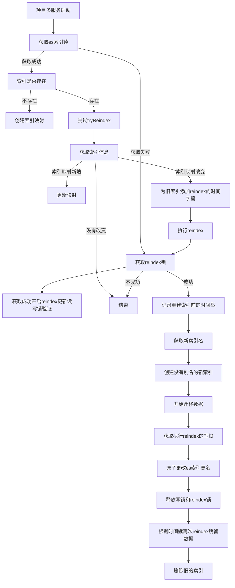
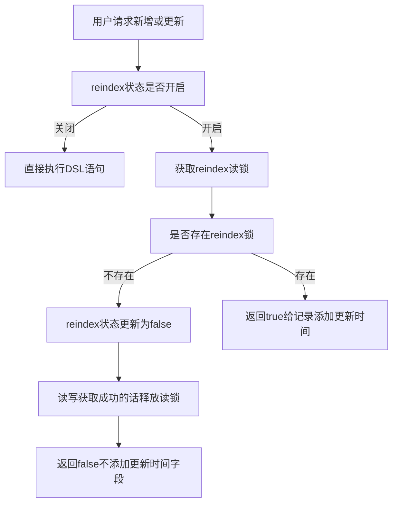

主服务reindex流程图

```mermaid
graph TD
项目多服务启动-->获取es索引锁-->|获取失败| 获取reindex锁--> 获取成功开启reindex更新读写锁验证
获取es索引锁-->|获取成功| 索引是否存在-->|不存在| 创建索引映射
 索引是否存在-->|存在| 尝试tryReindex-->获取索引信息--> |索引映射新增| 更新映射 
获取索引信息--> |没有改变| 结束 
获取索引信息--> |索引映射改变| 为旧索引添加reindex的时间字段--> 执行reindex-->获取reindex锁-->|不成功| 结束
获取reindex锁-->|成功| 记录重建索引前的时间戳-->获取新索引名-->创建没有别名的新索引-->开始迁移数据
-->获取执行reindex的写锁-->原子更改es索引更名-->释放写锁和reindex锁
-->根据时间戳再次reindex残留数据-->删除旧的索引

 
```

执行reindex时用户请求流程图

```mermaid
graph TD
用户请求新增或更新-->reindex状态是否开启-->|关闭| 直接执行DSL语句
reindex状态是否开启-->|开启| 获取reindex读锁--> 是否存在reindex锁-->|不存在|reindex状态更新为false-->读写获取成功的话释放读锁-->返回false不添加更新时间字段
是否存在reindex锁-->|存在| 返回true给记录添加更新时间

```

